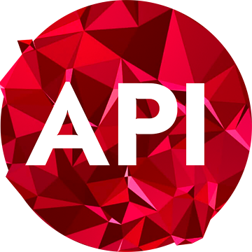
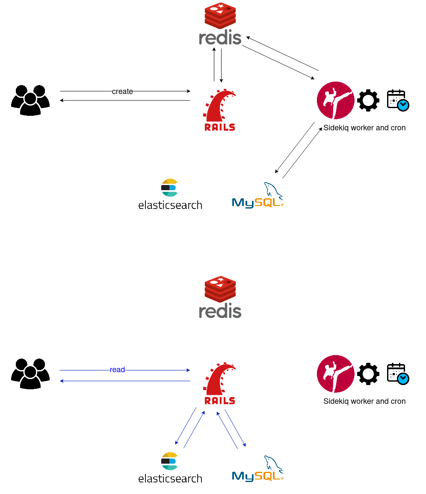
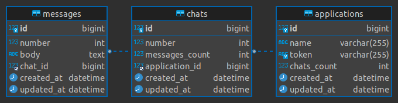
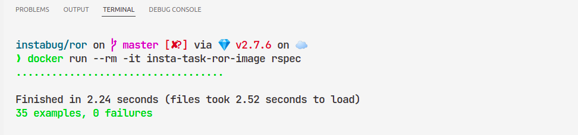
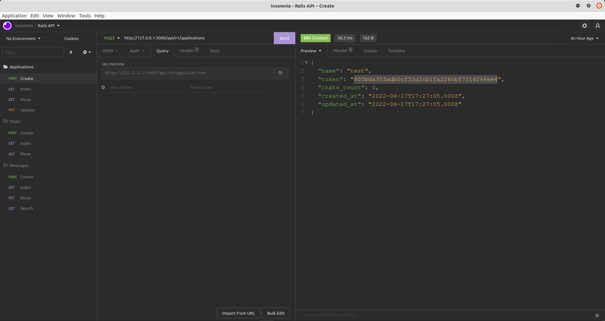
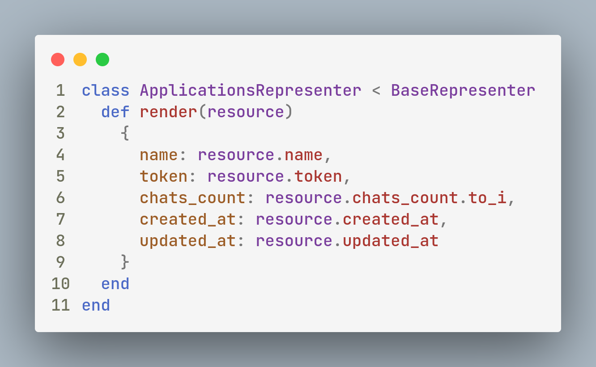
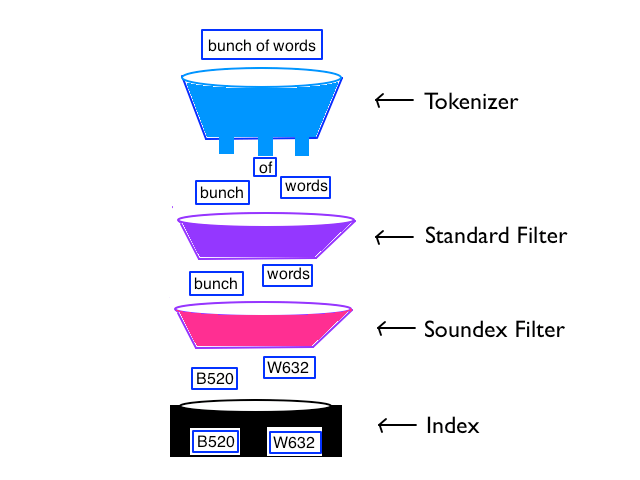
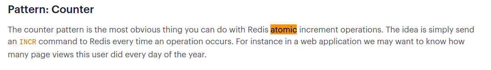

<p align="center">
  

  <h3 align="center">Rails API</h3>

  <p align="center">
    Intabug chat API (BE Engineer challenge).
  </p>
</p>

## Usage with docker

1. Clone the repo

```sh
git clone https://github.com/civilcoder55/rails-api.git
```

2. run containers

```sh
sudo docker-compose up -d
```

3. access api at http://localhost:3000/api/v1

4. access docs at http://localhost:4000/docs/

5. run specs

```sh
sudo docker run --rm -it insta-task-ror-image rspec
```

## API Client Collection

- click image to download insomnia api collection [can work with postman]

[](https://raw.githubusercontent.com/civilcoder55/rails-api/master/Insomnia_collection.json)

## API Endpoints

#### Applications Endpoints

| Method | URL                           | Description                    |
| ------ | ----------------------------- | ------------------------------ |
| `GET`  | `/api/v1/applications`        | Retrieve all applications.     |
| `POST` | `/api/v1/applications`        | Create a new application.      |
| `GET`  | `/api/v1/applications/:token` | Retrieve application by token. |
| `PUT`  | `/api/v1/applications/:token` | Update application by token.   |

#### Chats Endpoints

| Method | URL                                         | Description                          |
| ------ | ------------------------------------------- | ------------------------------------ |
| `GET`  | `/api/v1/applications/:token/chats`         | Retrieve all application chats.      |
| `POST` | `/api/v1/applications/:token/chats`         | Create a new application chat.       |
| `GET`  | `/api/v1/applications/:token/chats/:number` | Retrieve application chat by number. |

#### Messages Endpoints

| Method | URL                                                                     | Description                      |
| ------ | ----------------------------------------------------------------------- | -------------------------------- |
| `GET`  | `/api/v1/applications/:token/chats/:chat_number/messages`               | Retrieve all chat messages.      |
| `POST` | `/api/v1/applications/:token/chats/:chat_number/messages`               | Create a new chat message.       |
| `GET`  | `/api/v1/applications/:token/chats/:chat_number/messages/:number`       | Retrieve chat message by number. |
| `GET`  | `/api/v1/applications/:token/chats/:chat_number/messages?query=:search` | Search chat messages by query.   |

## screens

<h3 align="center">simple architecture diagram</h3>
<p align="center">
  
</p>

<h3 align="center">ERD</h3>
<p align="center">
  
</p>

<h3 align="center">Tests</h3>
<p align="center">
  
</p>


<p align="center">
  
</p>

## break down the task requirements

- applications tokens :

  - used SHA1 hash with random string + timestamp to ensure uniqueness .

- for resources numbring :

  - i choosed to keep tracking of numbring with cache store (Redis) instead of naive way of getting last resource number form
    database then increment it, so by this we save database hit

- for hiding resouce ID :

  - it can be done with many ways, maybe not selecting id when reading form database , or using serializers
    or even custom representers like what i did
    so i wrapped resource result with representer and i customed what fields should be returned

  <p align="center">
    
  </p>

- for identifies the application by its token and the chat by its number along with the application token

  - i used nested resource to achieve this "/api/v1/applications/:token/chats/:number"

- for partially search messages bodies with elasticsearch

  - i used simple elasticsearch text mapping to make use of inverted index that supports very fast full-text searches.

  <p align="center">
    
  </p>

- to be running on multiple servers and race conditions

  - for multiple server and centralized database and cache server scenario, we will have race condition when fetching and
  updating the next resource number
  for this we need some mutex locking, so redis provide us with atomic counter incr
  and also we don't need to locking as it's one atomic command.
  <p align="center">
    
  </p>

- to avoid writing directly to MySQL
  - i used queuing systme to push write operations to, and a sidekiq worker to consume and do writes
    for queuing we can use any queuing system like rabbitmq,sqs,redis - i choosed redis
- for updating counts in database

  - i used simple sidekiq cron task to run every 15 minutes to updated mysql columns from redis cache

- i didn't implement pagination but for this i will go for cursor pagination because it perform better than offset

- for indexes i added index for application token and composite index for application foriegnkey + number for chats and
  messages

## Built With

- Ruby (2.7.6)
- Rails (5.2)
- ElasticSearch (7.13.4)
- MySQL
- Redis

## todo

- [x] read and analyze task doc
- [x] create new rails app and setup initial configs
- [x] create database models and migrations
- [x] create applications/chats/messages rest endpoints
- [x] integrate elasticsearch for message searching
- [x] add redis for chats/message counts tracking
- [x] queue database writes with sidekiq/redis
- [x] add counts updater cron
- [x] write specs
- [x] dockerize application stack
- [x] optimizing
- [x] create readme file
